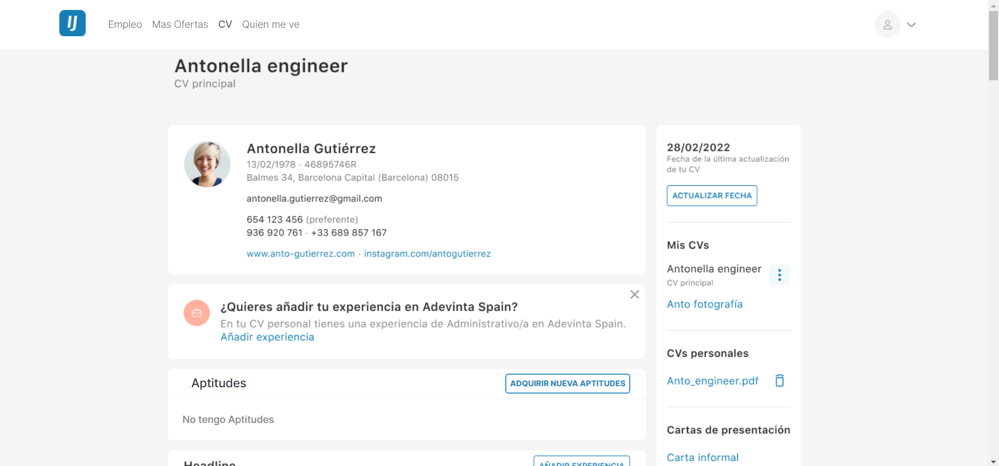
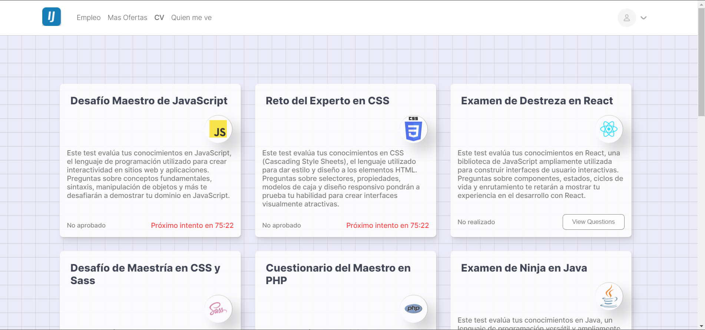
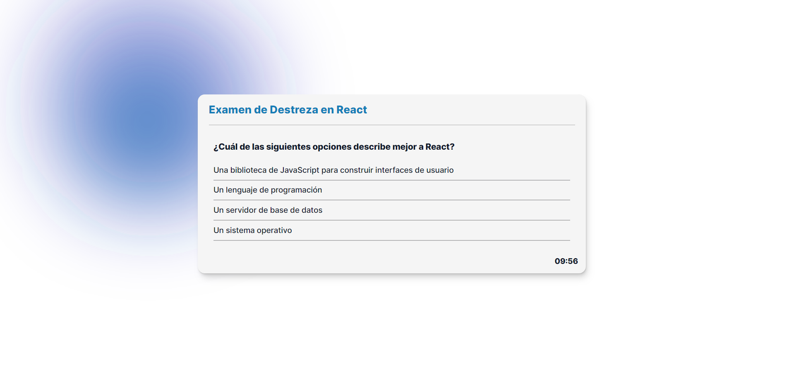
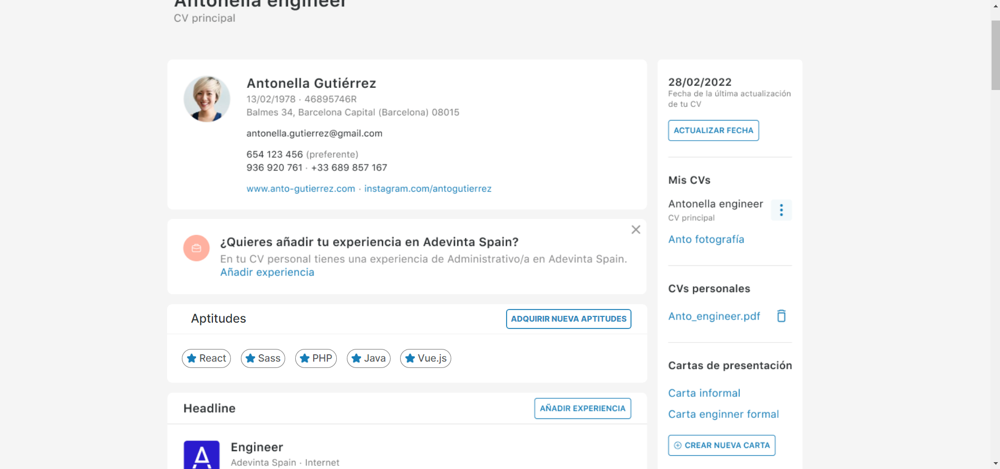

# Proyecto de Hackathon InfoJobs - Test de Aptitudes

Este proyecto fue desarrollado para la hackathon de InfoJobs con el objetivo de agregar un conjunto de preguntas de prueba de aptitudes a la plataforma. Estas preguntas proporcionarán a los reclutadores un punto adicional para evaluar las habilidades de los solicitantes.

## Descripción del proyecto

El objetivo principal de este proyecto es mejorar el proceso de selección de candidatos en InfoJobs mediante la adición de un componente de evaluación de aptitudes. Los reclutadores podrán utilizar las preguntas de prueba de aptitudes como una herramienta adicional para medir las habilidades de los postulantes y tomar decisiones más informadas.

El proyecto consiste en la implementación de las siguientes características:

- Una nueva sección en la plataforma de InfoJobs que contiene una serie de preguntas de prueba de aptitudes.
- Un algoritmo de calificación que evalúa las respuestas de los solicitantes y genera una puntuación basada en sus respuestas.
- Una interfaz para que los reclutadores vean las puntuaciones de los postulantes en las pruebas de aptitudes, además de su perfil y currículum.

## Características

- Preguntas de prueba de aptitudes: Se incluirá un conjunto de preguntas cuidadosamente seleccionadas que cubren una variedad de habilidades relevantes para las posiciones disponibles.
- Calificación automática: El sistema proporcionará un algoritmo de calificación automatizado que evaluará las respuestas de los solicitantes y generará una puntuación objetiva.
- Visualización de puntuaciones: Los reclutadores podrán ver las puntuaciones de los postulantes en las pruebas de aptitudes junto con su perfil y currículum.
- Integración con el sistema existente: El proyecto se integrará con la plataforma de InfoJobs, aprovechando su estructura y funcionalidades existentes.

## Despliegue

Link: https://infojobs-questions.netlify.app/

## Capturas de pantalla

Aquí se presentan algunas capturas de pantalla del proyecto:

### Sección de CV con enlace a las preguntas

### Preguntas de prueba de aptitudes

### Test de aptitudes en progreso

### Aprobación de aptitud

## Autores

- [Leandro Farias](https://github.com/LeandroF01) - Desarrollo principal

## Contacto

Si tienes alguna pregunta o sugerencia acerca de este proyecto, no dudes en ponerte en contacto leandro.dev.fa@gmail.com o a través de la sección de problemas (issues) de GitHub.
